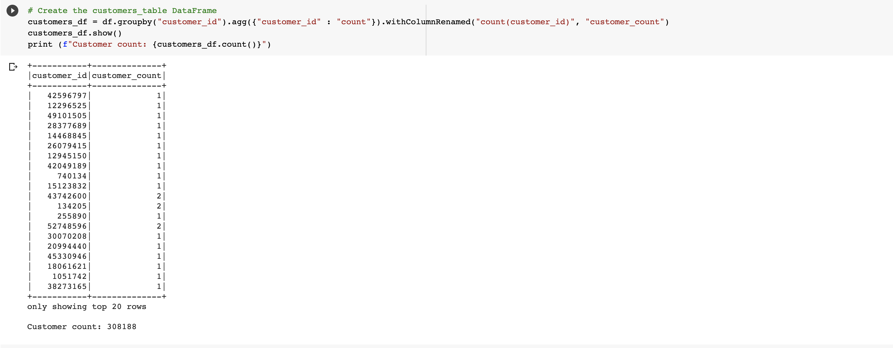
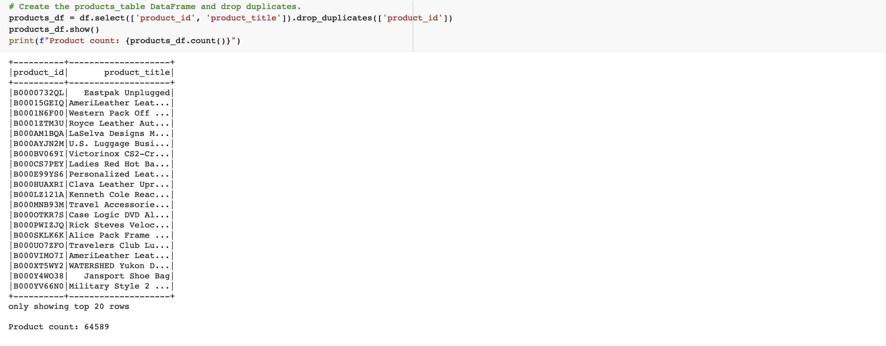
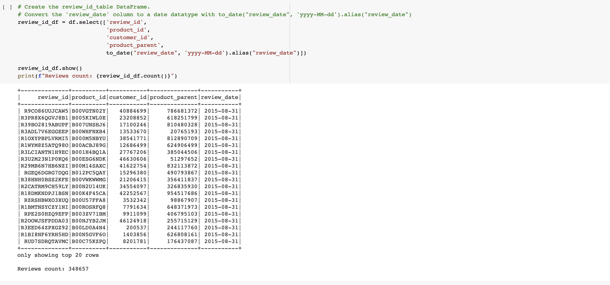

# Overview

In this exercise, we analyzed an Amazon product review dataset for the *luggage* category. Data was extracted from a publicly hosted AWS S3 bucket using Jupyter notebooks in *Google Collab*. *Pyspark* was chosen as the data extraction and loading tool since it offers support to read data in any format from AWS S3 and simultaneously can interact with a database hosted in AWS RDS.

After extracting data, it was converted into dataframes, where a series of transformations were applied to it. In particular, data was broken down into four distinct frames:
* All unique customers
* All unique reviews written by customers
* All unique products for which a review was written
* A special dataframe called *vine* was created to indicate if a review was written by someone from the Amazon's *Vine Review* program

Data could finally either by loaded into a postgres database hosted in AWS RDS using Spark, or could be further analyzed in Jupyter itself by filtering the dataframes. We chose the later route.

# Analysis

## Vine Program

In the Vine program, Amazon would pay certain reviewers a fee to accurately review products. This increases the integrity of the reviews and the overall trust of consumers in Amazon reviews. 

## Review Data

We extracted the *Luggage* review data available [here](https://s3.amazonaws.com/amazon-reviews-pds/tsv/amazon_reviews_us_Luggage_v1_00.tsv.gz). The code for doing so is in the Jupyter nodebook [here](Amazon_Reviews_ETL.ipynb).

The screenshot below shows 308K unique customers in the data.

There are ~65K unique products.

Finally, a total of ~349K unique reviews are written by customers.

## Vine Data

From the Jupyter notebook available [here](Vine_Review_Analysis.ipynb), we analyzed the data and found the following insights.

* A total of 7055 reviews had 20 or more votes. Only such reviews were considered for analysis.
* A total of 6711 reviews had 50% or more *helpful votes*. One thing that would be interesting to find is the exact percentage of helpful votes and whether this percentage increases as the number of votes increase.
* Only 21 reviews belongs to the Vine program. The percentage of Vine reviews seems unusually low; it would be interesting to find out if this holds for all reviews.
* 47.6% of Vine reviews were five stars (10 out of 21), whereas 51.5% of non-Vine reviews were five stars.
* **It seems that Vine reviews are more critical than non-Vine reviews, and the percentage of five-star reviews is lower for Vine reviews**.

# Conclusion and Future Work

* Vine reviews are more critical than non-Vine reviews influencing the trustworthiness of product reviews. We analyzed this by calculating the percentage of five-star reviews for both cases (47.5% versus 51.5%).
* Several further analysis can be done to measure the effectiveness of the Vine program.
  * Are the ratings affected by the price of the item?
  * Are the five-star percentage ratings affected by the total number of votes? For very popular products where several people would review the product anyway, it may not make sense to pay people to review the products.
